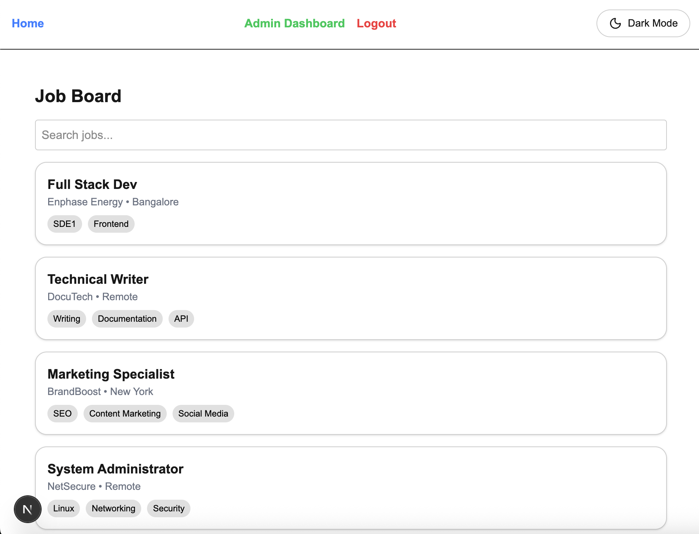
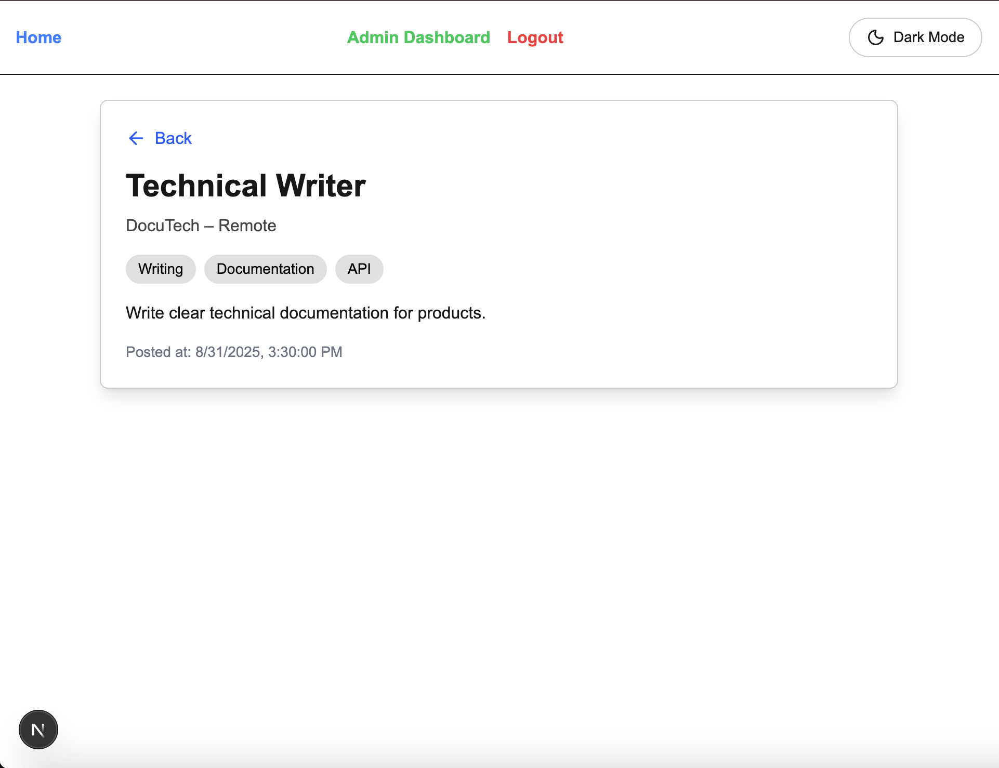
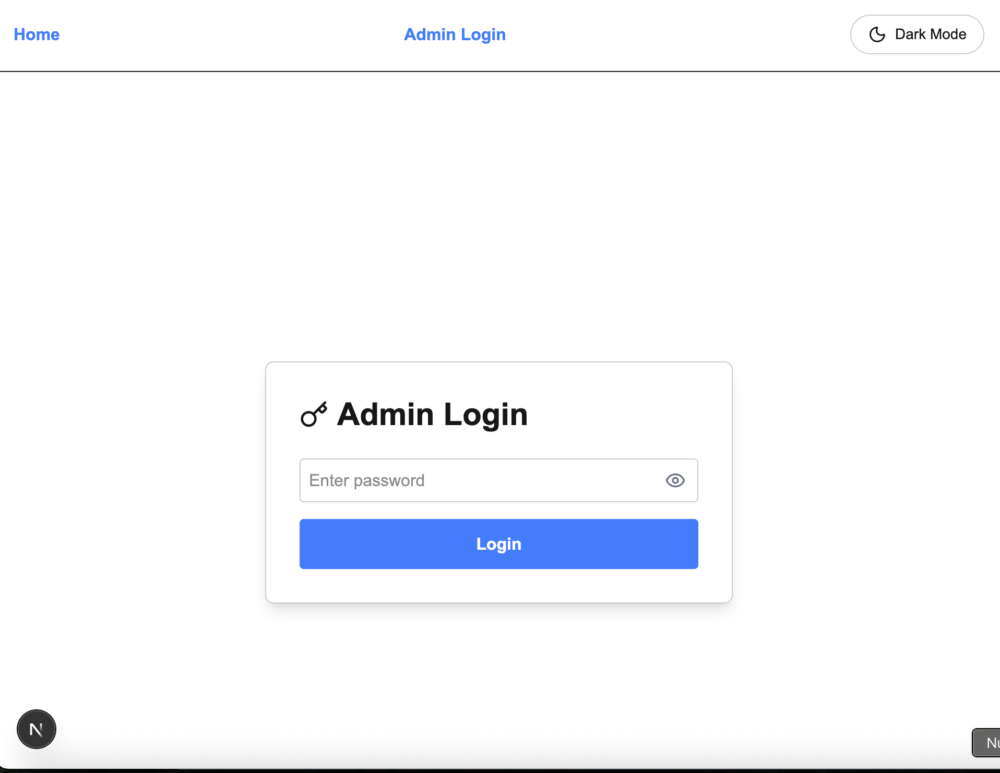
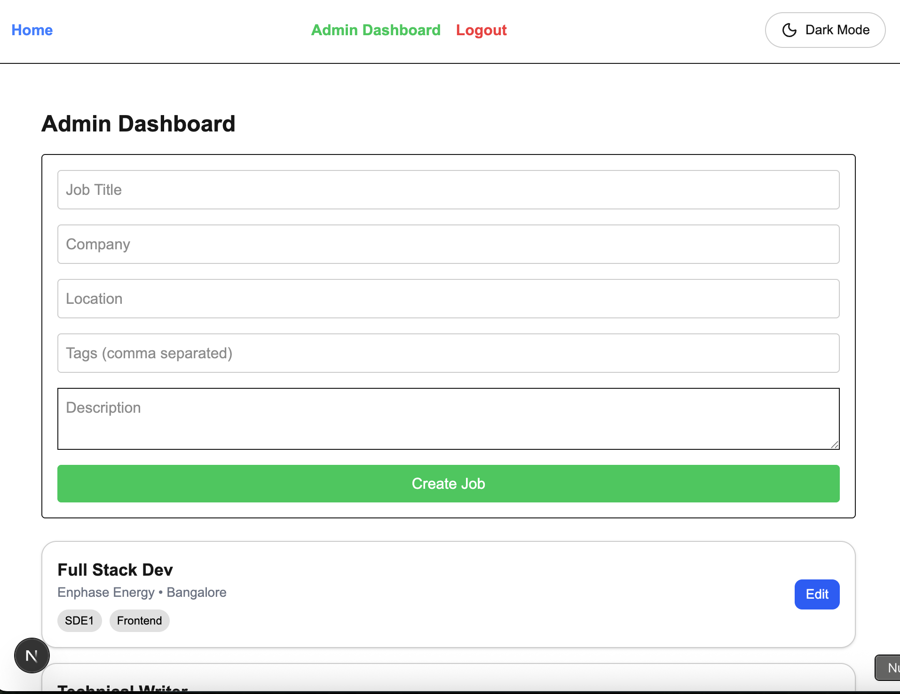
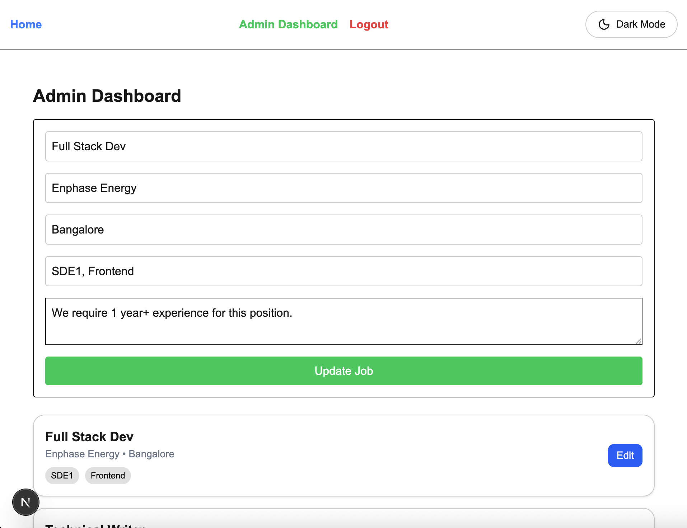

# Mini Job Board - Next.js

[ GitHub Link](https://github.com/sharmaHarshit2000/mini-job-board)

A mini job board application built with **Next.js App Router**, demonstrating SSR/ISR, dynamic routes, API routes, server actions, middleware, and client/server component separation.

---

## Table of Contents

- [Overview](#overview)
- [Features](#features)
- [API Endpoints](#api-endpoints)
- [Project Structure](#project-structure)
- [Setup Instructions](#setup-instructions)
- [Running the Project](#running-the-project)
- [Screenshots](#screenshots)
- [Notes](#notes)

---

## Overview

This project allows users to view jobs, filter by tags, and navigate job details. Admins can create and update jobs via a protected dashboard. Data is stored in-memory in `src/data/jobs.ts`.

---

## Features

- Home page listing jobs with filters
- Job detail page with back navigation
- Admin dashboard to create/update jobs
- Middleware protection for `/admin`
- Login page with password-protected admin access
- Loading and error UI components
- Pagination and tag-based filtering (bonus)
- Edge runtime for APIs

---

## API Endpoints

### `GET /api/jobs`
- Fetch all jobs
- Optional query params:
  - `limit`: number of jobs per page
  - `offset`: starting index
  - `tags`: filter jobs by comma-separated tags

### `POST /api/jobs`
- Create or update a job
- Body:
```json
{
  "id": "update",
  "title": "Frontend Developer",
  "company": "TechCorp",
  "location": "Remote",
  "description": "Build modern web apps",
  "tags": ["React","TypeScript"]
}
```

### `GET /api/jobs/[id]`
- Fetch single job by ID
- Returns `404` if job not found

---

## Project Structure

```
app/
├─ api/jobs/                 # API routes
├─ admin/page.tsx            # Admin dashboard
├─ jobs/[id]/page.tsx        # Job detail page
├─ login/page.tsx            # Admin login
├─ error.tsx                 # Global error boundary
├─ loading.tsx               # Global loading component
components/
├─ JobForm.tsx               # Job creation/edit form
├─ JobList.tsx               # Job list rendering
├─ Header.tsx                # App header
context/
├─ AdminProvider.tsx         # Admin state context
data/
├─ jobs.ts                   # In-memory jobs data
middleware.ts                # Admin route protection
```

---

## Setup Instructions

1. Clone the repo:
```bash
git clone https://github.com/sharmaHarshit2000/mini-job-board.git
cd mini-job-board
```

2. Install dependencies:
```bash
npm install
# or
yarn
```

3. Run the development server:
```bash
npm run dev
# or
yarn dev
```

4. Open your browser at [http://localhost:3000](http://localhost:3000)

---

## Running the Project

- **Home page:** `/`  
- **Job detail:** `/jobs/[id]`  
- **Admin dashboard:** `/admin` (requires login)  
- **Admin login:** `/login` (password: `letmein`)  

---


## 📸 Screenshots

### 1. Home Page


### 2. Job Detail Page


### 3. Admin Login Page


### 4. Admin Dashboard / Create Job


### 5. Edit Job Form (Optional)



---

## Notes

- In-memory data: any changes will reset on server restart.
- Middleware protects `/admin` routes using a cookie `admin=1`.
- Server actions (`createOrUpdateJobAction`) handle job creation/update instead of fetch POST.
- 404 page included for invalid routes and invalid job IDs.

---

## License

MIT License © Harshit Sharma

